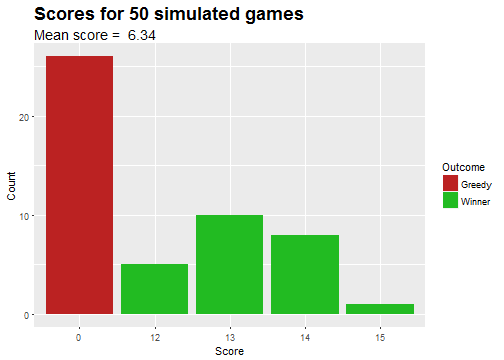

<style>
.title-slide {
  background-color: #ffad33; 
}
.title-slide hgroup > h1 {
color: #b30000;
font-family: 'Times';
}
.title-slide hgroup > h2 {
color: #b30000;
font-family: 'Times';
}
slide:not(.segue)  h2 {
color: #b30000;
font-family: 'Times';
}
</style>

## Introduction

<center></center>

In the simple dice game called 'Greedy', you roll the dice as many times as you like, accumulatng your score. 
But if you get too greedy and don't stop before you roll a 6, you lose everything!

In this simulation, you can set the following:
* Minimum score to aim for (i.e. you stop rolling when it is reached)
* Number of games to simulate
* Attempting to beat the best previous score. e.g. A group of friends trying to beat each other.

The point of the simulation is to demonstrate the best strategy to do well in this game.

Being too greedy (taking too much risk) results in poor reward.

--- .class #id 

## How it works

A single game is simulated with the following code:


```r
        repeat{
            roll <- sample(1:6,1) #Dice roll
            if (roll == 6) { # Greedy, game over, score is zero
                score <- 0
                break
            } else {
                score <- score + roll # Accumulate score
            }
            if ((!beatPrevious & score >= risk) | (score >= risk & score > best)){
                break
            }
        }
```

This code is within the greedyResults function

---

## Example


A call to this function, with a risk (minumum score aimed for) of 12 and 10 simulations:


```r
greedyResults(12, 10, FALSE)
```

```
##  [1]  0 12 14 12  0  0  0 12 15 12
```

In the shiny app, the results are:
1) Saved in a data.frame
2) The final outcome (winner or greedy loser) is added
3) The results are then displayed as a bar chart, with the mean score obtained stated.

```r
set.seed(123)
gScores <- greedyResults(12, 50, FALSE)
# Form data.frame with scores
greedyScores <- data.frame(score = gScores)
# Add end outcome
greedyScores$Outcome <- ifelse(greedyScores$score == 0, "Greedy", "Winner")
```

---


```r
library(ggplot2)
meanscore <- mean(greedyScores$score)
        ggplot(greedyScores, aes(x = factor(score), fill = Outcome)) +
            geom_bar() +
            scale_fill_manual(values=c("#BB2222", "#22BB22")) +
            labs(title = paste("Scores for", 50, "simulated games"), x = "Score", y = "Count", subtitle = paste("Mean score = ", meanscore)) +
            theme(plot.title = element_text(size = 18, face = "bold"), plot.subtitle = element_text(size = 14))
```


